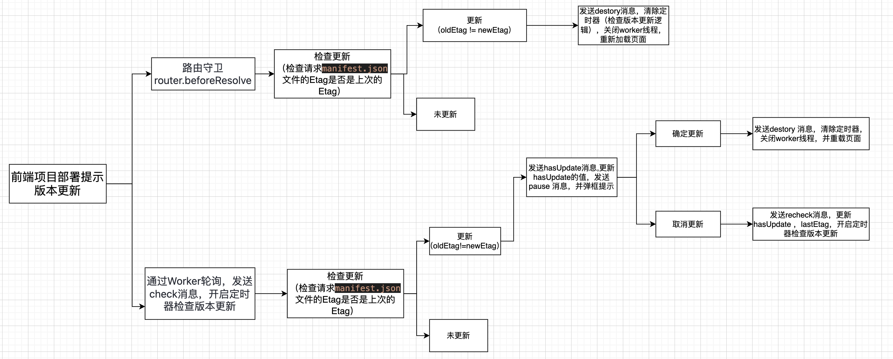

## 前端版本更新通知

前端新版打包上线后，如何在用户访问时弹出更新提示？
[参考链接](https://blog.csdn.net/qq_38951259/article/details/136739490?ops_request_misc=%257B%2522request%255Fid%2522%253A%2522e826a50781c902fd61ee49b77056a975%2522%252C%2522scm%2522%253A%252220140713.130102334.pc%255Fall.%2522%257D&request_id=e826a50781c902fd61ee49b77056a975&biz_id=0&utm_medium=distribute.pc_search_result.none-task-blog-2~all~first_rank_ecpm_v1~rank_v31_ecpm-4-136739490-null-null.nonlogin&utm_term=%E5%89%8D%E7%AB%AF%E6%9B%B4%E6%96%B0%E7%89%88%E6%9C%AC%E9%80%9A%E7%9F%A5%E7%94%A8%E6%88%B7&spm=1018.2226.3001.4187)

#### 解决方案

每次打包时，都生成一个时间戳，作为系统的伪版本，放到JSON文件中，通过对比文件的响应头Etag判断是否有更新。具体步骤如下：

1. 在public文件夹下加入manifest.json文件，里面存放两个字段：更新内容、更新时间戳
2. 前端打包的时候向manifest.json写入当前时间戳信息
3. 在入口文件main.js中引入检查版本更新的逻辑，有更新则提示更新。有两种方式提示提示用户：
   _ 路由守卫router.beforeResolve（Vue-Router为例），检查更新，对比manifest.json文件的响应头Etag判断是否有更新
   _ 通过Worker轮询，检查更新，对比manifest.json文件的响应头Etag判断是否有更新。Worker线程并不影响其他线程的逻辑。
   

#### 1. public目录下新建version.json

```json
{
  "timestamp": 1764817552337,
  "msg": "系统有新版本发布"
}
```

#### 2. 前端打包时写入时间戳到version.json文件

在vite.config.ts中配置：

```javascript
import path from 'path';
import { readFileSync, writeFileSync } from 'fs';
// ...

export default ({ command, mode }: ConfigEnv) => {
  // ...
  return defineConfig({
    // ...
    plugins: [
      // 自定义插件：构建时更新version.json
      {
        name: 'update-version',
        // 在构建开始时执行
        buildStart() {
          const versionPath = path.resolve(root, 'public/version.json');
          try {
            // 读取现有的version.json文件
            const version = JSON.parse(readFileSync(versionPath, 'utf-8'));
            // 更新时间戳
            version.timestamp = Date.now();
            // 写回文件
            writeFileSync(versionPath, JSON.stringify(version, null, 2));
            console.log('✅ 已更新version.json的时间戳');
          } catch (error) {
            console.error('❌ 更新version.json失败:', error);
          }
        }
      },
      // ...
    ],
    // ...
  });
};
```

#### 3. 检查更新逻辑 checkUpdate.ts

```typescript
/*
 * @FilePath: /vue3-template-project/src/utils/version/checkUpdate.ts
 * @Description: 检查前端更新版本
 */
import { Button, notification, Space } from 'ant-design-vue';
import { h } from 'vue';

// 保存上次的ETag
let lastEtag = '';
// 是否有更新
let hasUpdate = false;
// Worker实例
let worker: Worker | null = null;

/**
 * 检查更新函数
 * 通过对比version.json的ETag来判断是否有更新
 */
export const checkUpdate = async (): Promise<boolean> => {
  try {
    // 发送HEAD请求获取version.json的响应头
    const response = await fetch(`/version.json?v=${Date.now()}`, {
      method: 'HEAD'
    });

    // 获取最新的ETag
    const etag = response.headers.get('etag');
    console.log(etag);
    // 如果是首次检查或者ETag发生变化，则认为有更新
    // 为了测试目的，首次检查也可以认为有更新
    hasUpdate = !!lastEtag && etag !== lastEtag;
    // hasUpdate = !lastEtag || (!!lastEtag && etag !== lastEtag);

    // 保存当前ETag
    lastEtag = etag || '';

    return hasUpdate;
  } catch (error) {
    console.error('检查更新失败:', error);
    return false;
  }
};

/**
 * 获取version.json的内容
 */
export const getVersionContent = async (): Promise<{ timestamp: number; msg: string } | null> => {
  try {
    const response = await fetch('/version.json');
    return await response.json();
  } catch (error) {
    console.error('获取version.json内容失败:', error);
    return null;
  }
};

/**
 * 显示更新提示
 */
export const showUpdateNotification = async () => {
  const version = await getVersionContent();
  const updateMsg = version?.msg || '系统有新版本发布';

  notification.open({
    message: '系统更新提示',
    description: () => h('div', [h('div', updateMsg), h('div', '请点击「立即刷新」更新到最新版本')]),
    btn: () =>
      h(Space, [
        h(
          Button,
          {
            type: 'primary',
            onClick: () => {
              // 销毁Worker
              if (worker) {
                worker.postMessage({ type: 'destroy' }); // 销毁Worker实例
                worker.terminate(); // 终止Worker
              }
              // 刷新页面
              location.reload();
            }
          },
          { default: () => '立即刷新' }
        ),
        h(
          Button,
          {
            type: 'primary',
            onClick: () => {
              // 5分钟后再次检查更新
              if (worker) {
                worker.postMessage({ type: 'recheck', delay: 5 * 60 * 1000 });
                // worker.postMessage({ type: 'recheck', delay: 10 * 1000 });
              }
              notification.close(version?.timestamp?.toString() || 'update-notification');
            }
          },
          { default: () => '稍后提示' }
        )
      ]),
    key: version?.timestamp?.toString() || 'update-notification',
    duration: 0,
    onClose: () => {
      // 5分钟后再次检查更新
      if (worker) {
        worker.postMessage({ type: 'recheck', delay: 5 * 60 * 1000 });
        // worker.postMessage({ type: 'recheck', delay: 10 * 1000 });
      }
    }
  });
};

/**
 * 初始化更新检查
 * 仅在生产环境运行
 */
export const initUpdateChecker = () => {
  // 只在生产环境执行
  console.log(import.meta.env);
  if (import.meta.env.PROD) {
    // 立即进行一次更新检查
    checkUpdate().then(async updateAvailable => {
      if (updateAvailable) {
        await showUpdateNotification();
      } else {
        // 如果没有更新，启动Worker进行轮询
        startUpdateWorker();
      }
    });
  }
};

/**
 * 启动更新检查Worker
 */
export const startUpdateWorker = () => {
  if (worker) return;

  try {
    // 创建Worker
    worker = new Worker(new URL('./checkUpdate.worker.ts', import.meta.url), {
      type: 'module'
    });

    // 监听Worker消息
    worker.onmessage = async event => {
      console.log('Worker消息:', event);
      if (event.data.type === 'hasUpdate') {
        await showUpdateNotification();
      }
    };

    // 启动检查
    worker.postMessage({ type: 'start' });
  } catch (error) {
    console.error('创建Worker失败:', error);
  }
};

/**
 * 停止更新检查
 */
export const stopUpdateChecker = () => {
  if (worker) {
    worker.postMessage({ type: 'destroy' });
    worker.terminate();
    worker = null;
  }
};

export default {
  checkUpdate,
  showUpdateNotification,
  initUpdateChecker,
  stopUpdateChecker
};
```

#### 4. woker线程 checkUpdate.worker.ts

```typescript
/*
 * @FilePath: /vue3-template-project/src/utils/version/checkUpdate.worker.ts
 * @Description: 更新检查Worker线程
 */

// 定义Worker的消息类型
interface WorkerMessage {
  type: 'start' | 'stop' | 'recheck' | 'destroy';
  delay?: number;
}

// 检查间隔（默认5分钟）
const DEFAULT_CHECK_INTERVAL = 5 * 60 * 1000;
// const DEFAULT_CHECK_INTERVAL = 10 * 1000;
let checkInterval: number | null = null;
let lastEtag = '';

/**
 * 检查更新函数
 */
const checkForUpdates = async () => {
  try {
    console.log('检查更新函数', Date.now());
    // 发送HEAD请求获取version.json的响应头
    const response = await fetch('/version.json?v=' + Date.now(), {
      method: 'HEAD',
      cache: 'no-cache'
    });

    const etag = response.headers.get('etag');

    // 更新lastEtag
    const previousEtag = lastEtag;
    if (etag) {
      lastEtag = etag;
    }

    // 只在ETag从有到变化时才认为有更新
    // 这样避免首次检查就认为有更新
    if (previousEtag && etag && etag !== previousEtag) {
      // 发送消息给主线程，通知有更新
      self.postMessage({ type: 'hasUpdate' });
      // 清除定时器，避免重复提示
      if (checkInterval) {
        clearInterval(checkInterval);
        checkInterval = null;
      }
    }
  } catch (error) {
    console.error('Worker检查更新失败:', error);
  }
};

/**
 * 开始定时检查
 */
const startChecking = (interval = DEFAULT_CHECK_INTERVAL) => {
  // 先执行一次检查
  checkForUpdates();

  // 设置定时检查
  checkInterval = setInterval(checkForUpdates, interval) as unknown as number;
};

/**
 * 停止定时检查
 */
const stopChecking = () => {
  if (checkInterval) {
    clearInterval(checkInterval);
    checkInterval = null;
  }
};

// 监听主线程消息
self.onmessage = (event: MessageEvent<WorkerMessage>) => {
  const { type, delay } = event.data;

  switch (type) {
    case 'start':
      // 开始检查
      startChecking();
      break;
    case 'stop':
      // 停止检查
      stopChecking();
      break;
    case 'recheck':
      // 延迟后重新检查
      stopChecking();
      setTimeout(() => {
        startChecking(delay || DEFAULT_CHECK_INTERVAL);
      }, delay || 0);
      break;
    case 'destroy':
      // 销毁Worker
      stopChecking();
      self.close();
      break;
  }
};

// 导出类型定义，用于TypeScript检查
export default {} as typeof Worker & (new () => Worker);
```

#### 5. 入口文件引入 main.ts

```typescript
import { createApp } from 'vue';
import App from './App.vue';
import router from './router';
import store from './store';
import * as updateUtils from '@/utils/version';

const app = createApp(App);
app.use(store).use(router);

// 初始化更新检查器
updateUtils.initUpdateChecker();

app.mount('#app');
```

#### 6. router.ts 路由守卫

```typescript
router.beforeEach(async (to, from, next) => {
  if (import.meta.env.PROD) {
    checkUpdate()
      .then(async updateAvailable => {
        if (updateAvailable) {
          await showUpdateNotification();
        }
      })
      .catch(err => {
        console.error('路由守卫中检查更新失败:', err);
      });
  }
});
```
